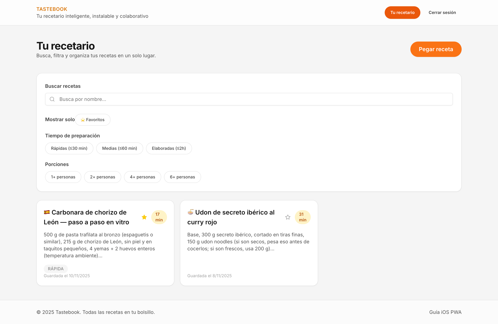
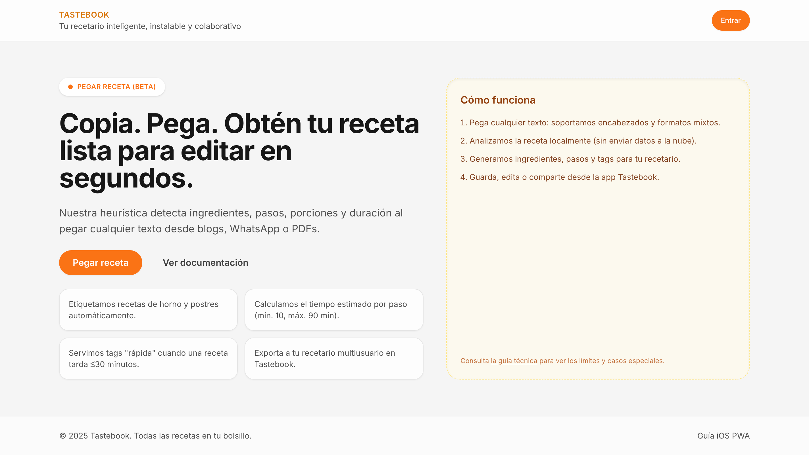

# Tastebook

Recetario colaborativo con instalación como PWA, sincronizado con Supabase y extracción inteligente de recetas pegadas desde texto plano.



## Requisitos

- Node.js 18.17+ y pnpm 8+
- Cuenta gratuita en Supabase y Vercel

## Puesta en marcha

```bash
pnpm install
pnpm run dev
```

Crea un archivo `.env.local` a partir de `.env.example` con las claves de Supabase y banderas de características.

> **Supabase**: Ejecuta las migraciones en tu proyecto antes de usar la aplicación:
> 1. `supabase/migrations/0001_create_recipes.sql` - Crea tabla recipes
> 2. `supabase/migrations/0002_add_is_favorite.sql` - Añade columna is_favorite
>
> Puedes usar `supabase db push` o ejecutar el SQL manualmente en el SQL Editor de Supabase Dashboard.
> Ver `docs/MIGRATIONS.md` para instrucciones detalladas.

## Scripts clave
- `pnpm dev`: arranca la aplicación en modo desarrollo.
- `pnpm build`: genera la build optimizada para Vercel.
- `pnpm test`: ejecuta la suite de Vitest.
- `pnpm test:e2e`: ejecuta Playwright (requiere `pnpm exec playwright install`).
- `pnpm lint`: ejecuta ESLint y reglas de estilo.
- `pnpm typecheck`: verifica los tipos con TypeScript estricto.

Tras la vista previa, pulsa **Guardar en Tastebook** para enviar la receta a Supabase (requiere sesión iniciada). El listado se refresca automáticamente en `/app`.

## Pegar recetas desde texto

El botón **Pegar receta** abre un diálogo que usa `parseRecipeFromText` para detectar título, ingredientes, pasos, porciones, duración y tags heurísticos (`horno`, `postre`, `rápida`).

Consulta `docs/EXTRACCION.md` para conocer el algoritmo y sus limitaciones.

## PWA en iPhone

- Manifesto en `public/manifest.json`.
- Iconos generados por `scripts/generate-icons.mjs` (`pnpm generate:icons`).
- Metadatos iOS en `src/app/layout.tsx` y guía en `/docs/pwa-ios`.
- `next-pwa` configura el service worker para cachear recursos estáticos y documentos.

## Documentación adicional

## Recetario (`/app`)

- Lista tus recetas guardadas (ordenadas por fecha descendente).
- Muestra duración, porciones y tags.
- Usa React Query para refrescar tras cada guardado.
- Protegeremos esta ruta con Supabase Auth conforme avancemos (ya admite sesión para guardar/listar).



## Autenticación

- `/login` ofrece enlace mágico por correo o acceso con GitHub (ambos gratuitos en Supabase).
- `/auth/callback` intercambia el código por una sesión y redirige a `/app`.
- El encabezado muestra el estado de sesión: botón **Entrar** o menú con **Tu recetario** + **Cerrar sesión**.


Toda la documentación de arquitectura, API, seguridad, despliegue y pruebas está en `docs/`.
