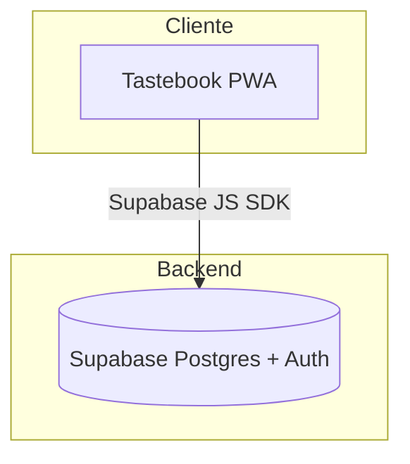

# Arquitectura

- **Next.js 14 (App Router)** con React 18 y TypeScript estricto.
- **TanStack Query** para caché de datos en cliente.
- **Tailwind + shadcn/ui** para UI consistente accesible.
- **Supabase** aporta autenticación y Postgres con RLS; Drizzle se usa para migraciones (pendiente de conexión en hitos posteriores).
- **next-pwa** genera el service worker y manifiesto para instalación en iOS.

## Flujo de «Pegar receta»

1. El usuario abre el diálogo `PasteRecipeDialog`.
2. El texto pegado se procesa localmente con `parseRecipeFromText`.
3. Se muestra vista previa con título, ingredientes, pasos, porciones, duración y tags heurísticos.
4. (Futuro) Persistencia en Supabase a través de API protegida.

## Decisiones clave

- Todo el parsing se ejecuta en el cliente para evitar coste en API externas.
- Servicio worker cachea HTML (network-first) y assets (stale-while-revalidate / cache-first).
- Iconos se generan a partir de script local para evitar dependencias de pago.
